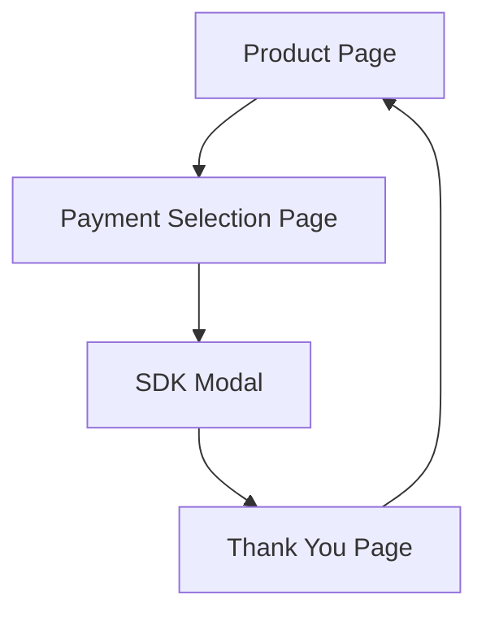

# Payment Gateway SDK Demo Website - Product Requirements Document

## 1. Product Overview
A minimalist static HTML website designed to demonstrate and test self-hosted payment gateway SDK integration with end-to-end transaction flow.

The platform provides a controlled environment for developers to validate SDK functionality, test payment flows, and ensure proper integration before production deployment.

## 2. Core Features

### 2.1 User Roles
No user authentication or role distinction required - all visitors have the same access level.

### 2.2 Feature Module
Our payment gateway demo consists of the following main pages:
1. **Product Page**: product display, pricing information, purchase initiation.
2. **Payment Selection Page**: payment method selection, SDK integration point, modal trigger.
3. **Thank You Page**: transaction confirmation, success messaging.

### 2.3 Page Details

| Page Name | Module Name | Feature description |
|-----------|-------------|---------------------|
| Product Page | Product Display | Show single product with name, description, and price in RWF |
| Product Page | Purchase Button | Display prominent "Buy Now" button that navigates to payment selection |
| Payment Selection Page | Payment Methods | Display available payment options (Mobile Money, Card, Bank Transfer) |
| Payment Selection Page | SDK Integration | Initialize and trigger payment gateway SDK modal for selected method |
| Payment Selection Page | Order Summary | Show product details and total amount for confirmation |
| Thank You Page | Success Message | Display payment confirmation and transaction success status |
| Thank You Page | Order Details | Show completed transaction information and reference number |

## 3. Core Process

**Main User Flow:**
1. User visits Product Page and views the demo product
2. User clicks "Buy Now" button to proceed to payment
3. User is redirected to Payment Selection Page
4. User selects preferred payment method
5. Payment gateway SDK modal opens for transaction processing
6. Upon successful payment, user is redirected to Thank You Page
7. User sees confirmation of successful transaction

## 4. User Interface Design

### 4.1 Design Style
- Primary colors: #2563eb (blue), #1f2937 (dark gray)
- Secondary colors: #f3f4f6 (light gray), #10b981 (green for success)
- Button style: Rounded corners (8px), solid background with hover effects
- Font: System fonts (Arial, sans-serif), 16px base size
- Layout style: Clean card-based design with centered content
- Icons: Simple SVG icons for payment methods and status indicators

### 4.2 Page Design Overview

| Page Name | Module Name | UI Elements |
|-----------|-------------|-------------|
| Product Page | Product Display | Centered card layout, product image placeholder, title (h1), description (p), price in large text with RWF currency |
| Product Page | Purchase Button | Large blue button, white text, hover animation, positioned below product details |
| Payment Selection Page | Payment Methods | Grid layout of payment option cards, icons for each method, radio button selection |
| Payment Selection Page | Order Summary | Right sidebar with product details, subtotal, and total in RWF |
| Payment Selection Page | SDK Integration | Hidden container for SDK initialization, modal trigger button |
| Thank You Page | Success Message | Large green checkmark icon, success heading, confirmation text |
| Thank You Page | Order Details | Simple table with transaction ID, amount, date, and payment method |

### 4.3 Responsiveness
Desktop-first design with mobile-adaptive layout using CSS media queries. Touch-friendly button sizes (minimum 44px) for mobile devices.