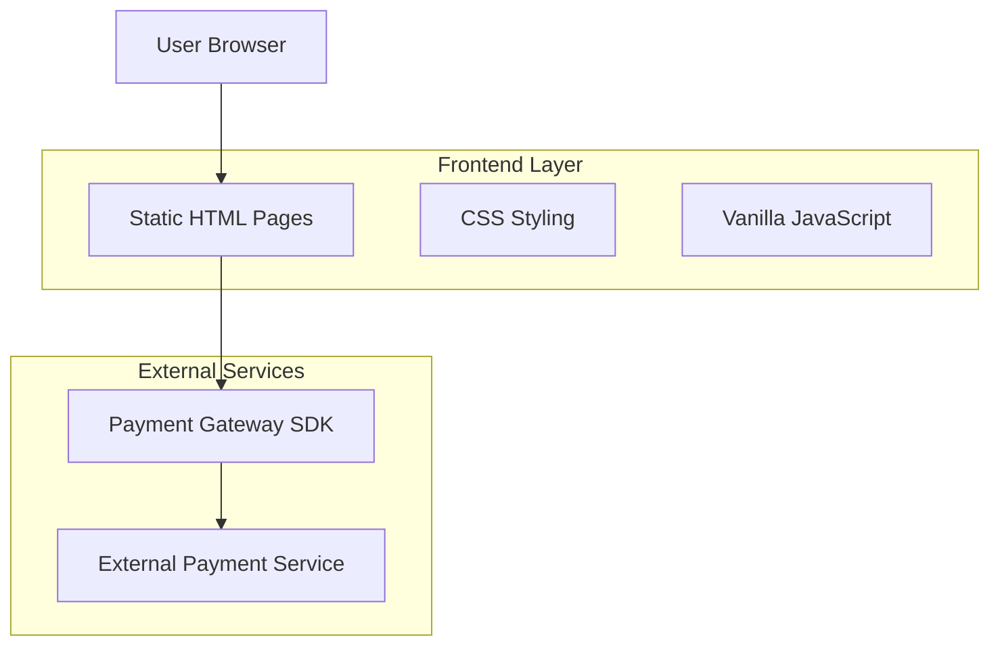
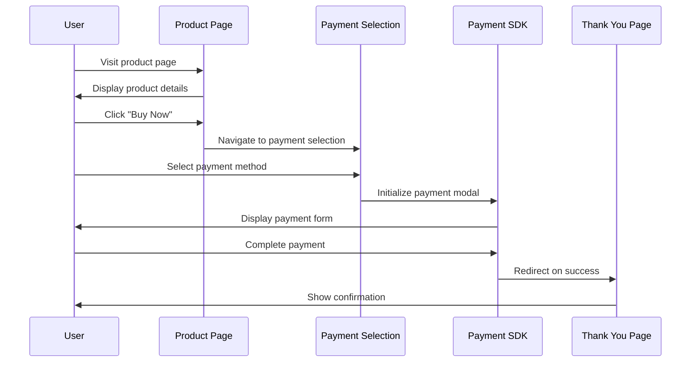

# Payment Gateway SDK Demo Website - Technical Architecture Document

## 1. Architecture Design



## 2. Technology Description

* Frontend: HTML5 + CSS3 + Vanilla JavaScript

* Styling: Custom CSS with responsive design

* SDK Integration: Payment Gateway SDK (to be integrated)

* Hosting: Static file hosting (no backend required)

## 3. Route Definitions

| Route          | Purpose                                               |
| -------------- | ----------------------------------------------------- |
| /index.html    | Product page displaying demo product with RWF pricing |
| /payment.html  | Payment selection page with SDK integration point     |
| /thankyou.html | Success page serving as SDK redirect URL              |

## 4. File Structure

```
/
├── index.html          # Product page
├── payment.html        # Payment selection page  
├── thankyou.html       # Thank you/success page
├── css/
│   └── styles.css      # Main stylesheet
├── js/
│   ├── main.js         # Common JavaScript functions
│   └── payment.js      # Payment SDK integration
└── assets/
    └── images/         # Product images and icons
```

## 5. SDK Integration Points

### 5.1 Payment Gateway SDK Integration

**Initialization**

```javascript
// Initialize SDK on payment.html
const paymentGateway = new PaymentSDK({
  apiKey: 'your-api-key',
  environment: 'sandbox', // or 'production'
  currency: 'RWF',
  redirectUrl: '/thankyou.html'
});
```

**Payment Processing**

```javascript
// Trigger payment modal
function processPayment(paymentMethod) {
  paymentGateway.openModal({
    amount: productPrice,
    method: paymentMethod,
    description: productName
  });
}
```

### 5.2 Page Navigation Flow



## 6. Data Model

### 6.1 Product Data Structure

```javascript
const demoProduct = {
  id: 'demo-001',
  name: 'Premium Software License',
  description: 'One-year subscription to premium features',
  price: 4000, // RWF
  currency: 'RWF',
  image: '/assets/images/product-demo.jpg'
};
```

### 6.2 Payment Configuration

```javascript
const paymentConfig = {
  methods: [
    {
      id: 'mobile_money',
      name: 'Mobile Money',
      icon: '/assets/images/mobile-money-icon.svg',
      enabled: true
    },
    {
      id: 'card',
      name: 'Credit/Debit Card', 
      icon: '/assets/images/card-icon.svg',
      enabled: true
    },
    {
      id: 'bank_transfer',
      name: 'Bank Transfer',
      icon: '/assets/images/bank-icon.svg', 
      enabled: true
    }
  ]
};
```

## 7. Deployment Requirements

* **Hosting**: Any static file hosting service (GitHub Pages, Netlify, Vercel)

* **Domain**: Optional custom domain for production testing

* **SSL**: HTTPS required for payment processing

* **Browser Support**: Modern browsers with ES6+ support

* **Mobile**: Responsive design for mobile testing

## 8. Security Considerations

* All payment processing handled by external SDK

* No sensitive data stored locally

* HTTPS enforcement for all pages

* SDK API keys should be environment-specific

* CSP headers recommended for production deployment

